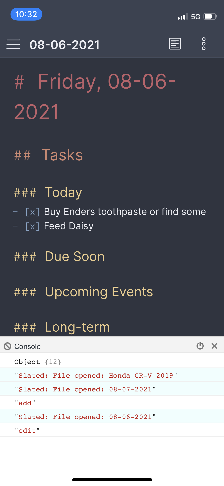
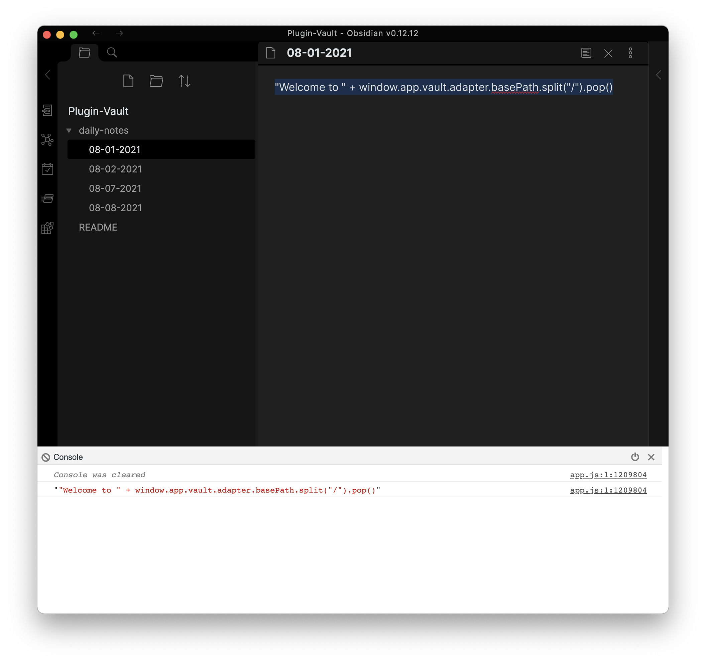
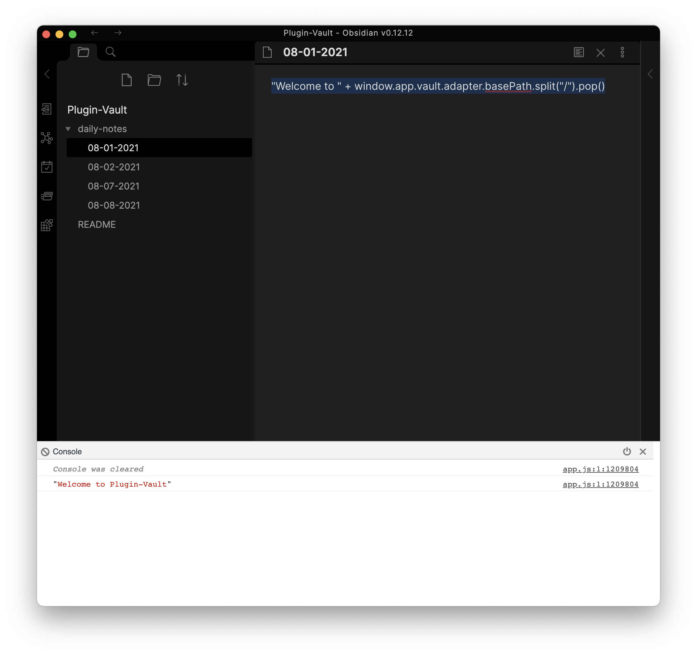

# Obsidian Dev Tools
This plugin is for developers to see their console output on mobile devices and do a bit of logging. It's easy to do on the Obsidian Desktop app, but not so easy for mobile.

*I plan to add other tools here, but for now, all you can do is use a modified console*

## Using Once Installed

### 1: Setup within Obsidian
1. Open `Settings`
2. Click `Options > Community Plugins` and make sure `Obsidian Dev Tools Plugin` is enabled (toggled on).

### 2: Using Commands

All commands are accessed through the `Command Palette` (CMD+P by default on macOS) and typing in the command.

---

#### Command 1: Toggle Console

This console can be **cleared**, **minimized**, and **closed** using the buttons. To log from mobile, run one of the two commands below.

---

#### Command 2: Log Highlighted Text

Highlight text, and run this command from the `Command Palette`. It will run `console.log(text)`. This can be viewed in the mobile console from **Command 1: Toggle Console**.

##### Example:

`"Welcome to " + window.app.vault.adapter.basePath.split("/").pop()`

---

#### Command 3: Log Eval Highlighted Text

Highlight text, and run this command from the `Command Palette`. It will run `console.log(eval(text))`. This can be viewed in the mobile console from **Command 1: Toggle Console**.

##### Example:

`"Welcome to " + window.app.vault.adapter.basePath.split("/").pop()`

