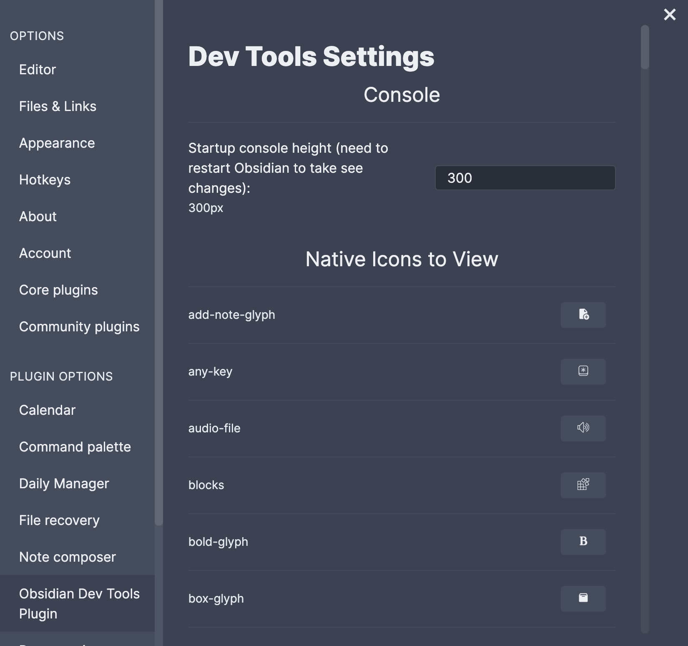

# Obsidian Dev Tools

This plugin is for developers, to make it easier to develop. It currently allows for a modified console (useful for debugging on mobile), and viewing all Obsidian icons/strings.

## Using Once Installed

### 1: Setup within Obsidian

1.  Open `Settings`
2.  Click `Options > Community Plugins` and make sure `Obsidian Dev Tools Plugin` is enabled (toggled on).

### 2: Using Commands

All commands are accessed through the `Command Palette` (CMD+P by default on macOS) and typing in the command.

* * *

#### Command 1: Toggle Console

This console can be **cleared**, **minimized**, and **closed** using the buttons. To log from mobile, run one of the two commands below.

* * *

#### Command 2: Log Highlighted Text

Highlight text, and run this command from the `Command Palette`. It will run `console.log(text)`. This can be viewed in the mobile console from **Command 1: Toggle Console**.

##### Example:

`"Welcome to " + window.app.vault.adapter.basePath.split("/").pop()`

* * *

#### Command 3: Log Eval Highlighted Text

Highlight text, and run this command from the `Command Palette`. It will run `console.log(eval(text))`. This can be viewed in the mobile console from **Command 1: Toggle Console**.

##### Example:

`"Welcome to " + window.app.vault.adapter.basePath.split("/").pop()`

### 3. Plugin Settings

You can access options from tapping `Settings > Obsidian Dev Tools Plugin`

#### Option 1: Console Height

Choose your console height in px. You need to restart Obsidian to see changes.

#### Option 2: Native Icons to View

These aren't really options. It's just a list of the native icons that Obsidian supports as of August 2021. This can be useful in choosing an icon for your commands (think mobile), or for ribbons (left side, next to the navigator) if you want commands added there. Often there will be key/value pairs for `icon : string`. Click the icon to copy the string to your clipboard.

_Note: I added this to Settings (Options) because the public API doesn't let me use them in such a large quantity anywhere else._

