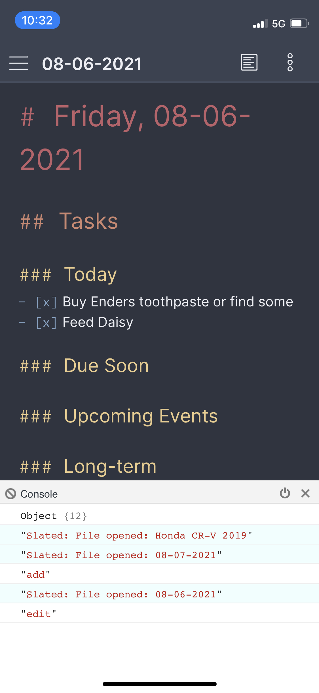

# Obsidian Dev Tools
This plugin is for developers to see their console output on mobile devices. It's easy to do on the Obsidian Desktop app, but not so easy for mobile.

*I plan to add other tools here, but for now, all you can do is view console output.*

## Using Once Installed

### 1: Setup within Obsidian
1. Open `Settings`
2. Click `Options > Community Plugins` and make sure `Obsidian Dev Tools Plugin` is enabled (toggled on).

### 2: Using Commands
Open the `Command Palette` (CMD+P by default on macOS) and start typing in `console`. You will see a command called `Obsidian Dev Tools Plugin: Toggle Console`. Once you tap this, a new button will appear at the bottom right hand of the screen. You can tap this to open the console. This console can be **cleared**, **minimized**, and **closed** using the buttons. You cannot type in the console, but it is useful for checking for errors when developing your own Obsidian plugins on mobile.

